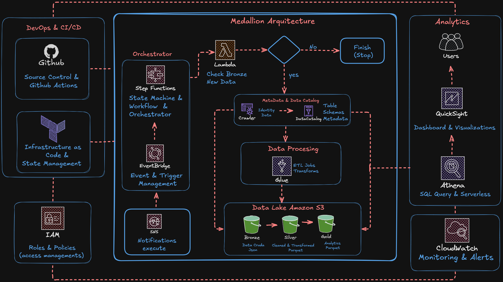

    # E-commerce Logs ETL Pipeline (Serverless - AWS)

Pipeline ETL 100% serverless en AWS que extrae, procesa y transforma logs de un e-commerce, siguiendo una **arquitectura Medallion** (Bronze / Silver / Gold) sobre un Data Lake en S3, con datos listos para análisis vía Athena y QuickSight.

## Tabla de contenido

- [Objetivo del proyecto](#objetivo-del-proyecto)
- [Arquitectura](#arquitectura)
- [Componentes y servicios AWS](#componentes-y-servicios-aws)
- [Flujo de ejecución](#flujo-de-ejecución)
- [Despliegue](#despliegue)
- [Resultados](#resultados)

## Objetivo del proyecto

Los logs del e-commerce se generaban en grandes volúmenes y sin un proceso automatizado para limpiarlos y analizarlos, lo que dificultaba obtener información útil del comportamiento de la plataforma.
Este proyecto implementa un pipeline ETL 100% serverless en AWS que ingiere, valida y transforma esos logs automáticamente, organizándolos en capas (Bronze, Silver, Gold) siguiendo el modelo Medallion.
Como resultado, los datos quedan limpios, catalogados y disponibles para ser consultados vía Athena y visualizados en dashboards de QuickSight, sin necesidad de gestionar servidores ni procesos manuales.
## Arquitectura



Esta es la arquitectura del pipeline. Se trata de un flujo **event-driven y 100% serverless**, organizado en tres bloques principales:

- **DevOps & CI/CD** (izquierda): GitHub gestiona el control de versiones y las automatizaciones, la infraestructura se maneja como código, y IAM controla los roles y permisos de acceso entre todos los servicios.
- **Medallion Architecture** (centro): es el corazón del pipeline. SNS notifica la llegada de nuevos datos, EventBridge dispara Step Functions, que orquesta todo el flujo: una Lambda valida si hay datos nuevos en Bronze, el Glue Crawler y el Data Catalog gestionan el esquema y la metadata, Glue ejecuta las transformaciones ETL, y los datos avanzan por las capas del Data Lake en S3 (Bronze → Silver → Gold).
- **Analytics** (derecha): una vez los datos están en la capa Gold, Athena permite consultarlos con SQL de forma serverless, y QuickSight los convierte en dashboards para los usuarios finales. CloudWatch monitorea todo el proceso y genera alertas.

## Componentes y servicios AWS

| Servicio | Rol en el pipeline |
|---|---|
| **EventBridge** | Dispara la ejecución del pipeline |
| **Step Functions** | Orquesta todo el flujo ETL |
| **Lambda** | Valida si hay datos nuevos en Bronze |
| **Glue Crawler / Data Catalog** | Detecta y cataloga el esquema de los datos |
| **Glue Jobs** | Ejecuta las transformaciones ETL |
| **S3 (Data Lake)** | Almacena los datos en capas Bronze, Silver y Gold |
| **Athena** | Consulta los datos con SQL de forma serverless |
| **QuickSight** | Genera dashboards y visualizaciones |
| **CloudWatch** | Monitorea el pipeline y genera alertas |
| **IAM** | Gestiona roles y permisos entre servicios |


## Flujo de ejecución

1. Llega un nuevo log y se guarda en la capa **Bronze** de S3.
2. **SNS** notifica el nuevo dato y **EventBridge** dispara **Step Functions**.
3. Una **Lambda** valida si hay datos nuevos:
   - No → el flujo termina (`Finish/Stop`).
   - Sí → continúa.
4. El **Glue Crawler** actualiza el **Data Catalog** con el esquema.
5. **Glue Jobs** transforma los datos (Bronze → Silver → Gold).
6. **Athena** consulta los datos en Gold y **QuickSight** los visualiza.
7. **CloudWatch** monitorea todo el proceso.


## Despliegue

La infraestructura se gestiona con **Terraform**, lo que permite crear y versionar todos los recursos AWS del pipeline (Lambda, Step Functions, Glue, S3, IAM, etc.) de forma reproducible.

```bash
# Clonar el repositorio
git clone <url-del-repositorio>
cd <nombre-del-repositorio>

# Configurar credenciales de AWS
aws configure

# Desplegar infraestructura
cd infra/
terraform init
terraform plan
terraform apply
```


## Resultados

Se logró implementar un pipeline **100% serverless** en AWS, totalmente automatizado, que procesa los logs del e-commerce sin necesidad de gestionar servidores.

Además, se agregaron medidas adicionales de control:

- **AWS Budgets**: alertas de facturación para evitar costos imprevistos.
- **SNS**: notificaciones automáticas ante eventos y ejecuciones del pipeline.

Como resultado final, el equipo cuenta con un flujo de datos automatizado, monitoreado y con control de costos, listo para escalar sin intervención manual.